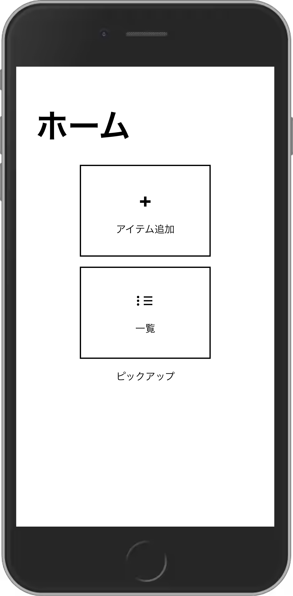
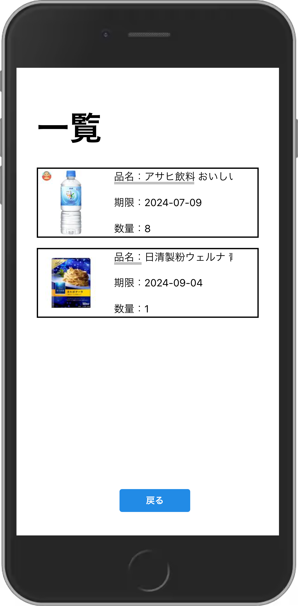
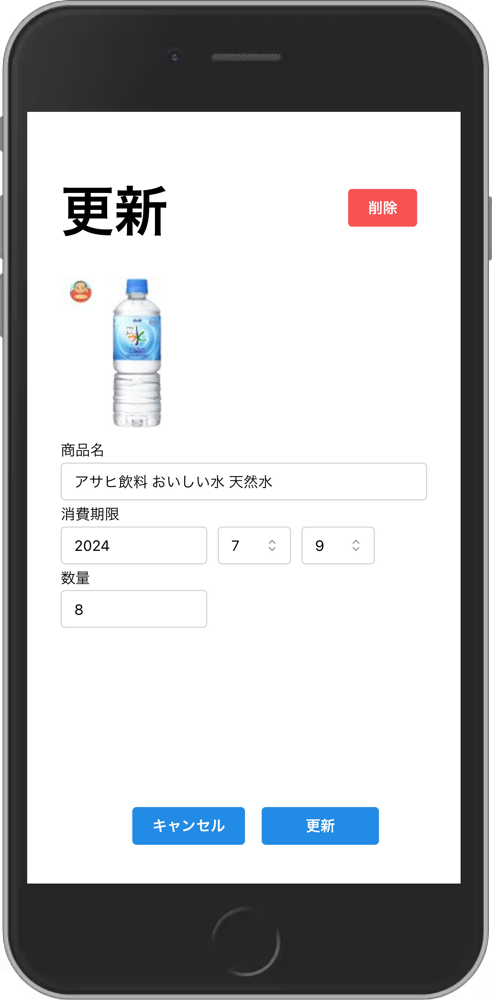
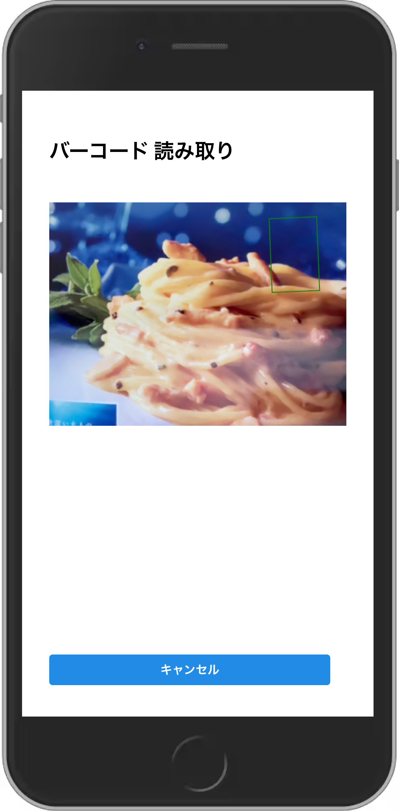
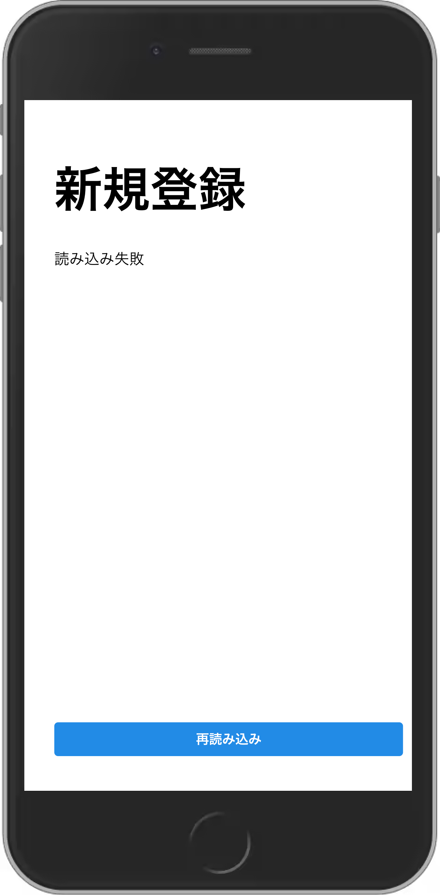
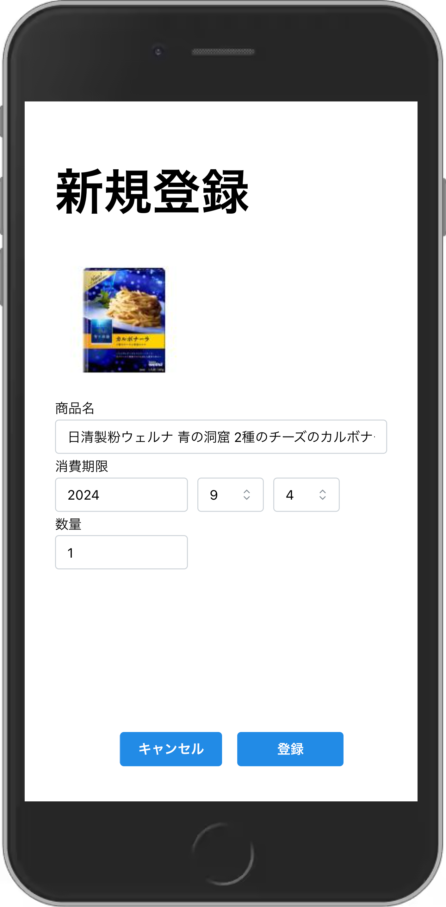

# 他言語プロジェクト

## 概要

食品の消費期限を管理するアプリ

## 使い方

アプリを立ち上げると**ホーム**画面が開きます。

 

**一覧**をクリックすると登録されているアイテム一覧が見れます。

  
  
 

画面のアイテムをクリックすると**更新**画面が現れて**更新**と**削除**が行える。  
**更新**は画面の記入欄を編集し**更新**ボタンをクリックすることで登録内容を更新できる。  
**削除**は画面の**削除**ボタンをクリックすることでアイテムの登録を削除できる。

 

**ホーム**画面から**アイテム追加**をクリックするとアイテムの新規登録ができます。

 

**アイテム追加**をクリックすると**バーコード読み込み**画面が表示されるので、  
カメラをバーコードに向けてください。  
※読み込むまでに時間がかかる場合があります。  
※袋など対象が歪んでいると読み込めない場合があります。

 

バーコードの読み込みに失敗した場合は**再読み込み**ボタンをクリックして再度読み込んでください。

 

無事、バーコードが読み込めると**新規登録**画面に移ります。  
消費期限や数量を記入し**登録**ボタンを押すと登録できます。

## 注意

Yahoo ショッピングの API を使用しているため、商品が登録されていない場合があります。  
Yahoo ショッピングの商品情報の為、商品に直接関係ない文章(送料無料等)や実際とは異なる商品数の表示（×12 箱セット等）の情報が含まれる場合があります。

## 今後の拡張機能

・バーコードを使わない直接入力
・画像では無く実際に撮影した写真を保存する機能
